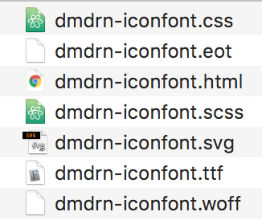
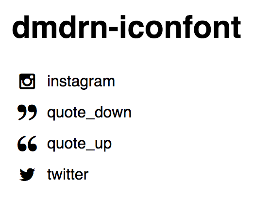

# Demodern Icon Font

We use [Webfonts-Generator](https://github.com/sunflowerdeath/webfonts-generator) to create an IconFont.
In Order to customize the icon font simple place your icons in `/icons` customize the name in `package.json` and run `npm run build`.

## Usage

Whenever you need to create an icon font follow these few simple steps:
* fork this project
* run `npm install`
* place your svg icons in the `icons` folder.
* run `npm run build`

and you should get these files in your `build` folder:

the entire magic happens in `lib`. there are the templates for css, html, scss and the main script which invokes [webfonts-generator](https://github.com/sunflowerdeath/webfonts-generator). 

if you want to embed this iconfont in your existing project instead of manually copy all files, you could once place the lib folder in your project and add an npm task to invoke `lib/iconfont.js`. the script is quite simple and should easily be customized to your special needs.

the result look like:

after the fonts and the css or the scss file are loaded you can use those icons as simple as:

    

